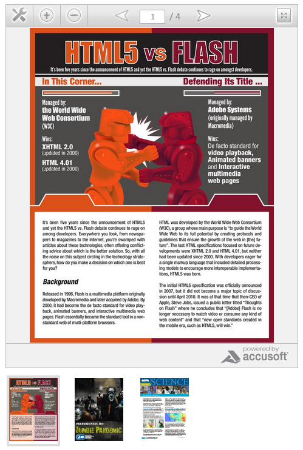

###PrizmCloud Javascript Examples

This example allows you to display the Prizm Cloud Viewer with clickable thumbnails which update the base viewer with a new document dynamically. Multiple viewers can be on the same page.



###Prerequisites

Your **html** should have the following

* An outer wrapper element with a unique id
	```
	<div id="prizmcloud-container">...</div>
	```
* Within the outer wrapper, a wrapper for the thumbnails
	```
	<div class="documents-for-switching" id="documents-for-switching">...</div>
	```
* Within the outer wrapper, a wrapper for the Document Viewer
	```
	<div class="prizmcloud-viewer" id="prizmcloud-viewer">...</div>
	```

###Javascript Options

* **type**: is the viewer type (either flash or html5)
* **doc_url**: is the document url
* **vwidth**: is the viewer width in px (int)
* **vheight**: is the viewer height in px (int)
* **print_button**: options 'Yes' or 'No'
* **toolbar_color**: hex color, no '#' for example "CCCCCC"
* **cache**: 'Yes' or 'No'

##Plain Javascript

The js file is located at javascript/prizmcloud.js.  Add this script to the header or footer of your page.
```
<script src="prizmcloud.js"></script>
```

###The HTML

The html needs the following

* the wrappers as described above
* the thumbnails must be anchors, for example:
	```
	<a href="http://www.accusoft.com/docs/prizm-cloud-flash-vs-html5.pdf"></a>
	```
 
```
<div id="prizmcloud-container">
    <div class="documents-for-switching" id="documents-for-switching"> 
        <a href="http://www.accusoft.com/docs/prizm-cloud-flash-vs-html5.pdf" class="doc-link"></a>
        <a href="http://www.cdc.gov/phpr/documents/11_225700_A_Zombie_Final.pdf" class="doc-link"></a>
    </div>
    <div class="prizmcloud-viewer" id="prizmcloud-viewer">
        <iframe id="viewerBox" width="420" height="450" frameborder="0" src="http://connect.ajaxdocumentviewer.com/?key=03232898832&viewertype=html5&document=http://www.accusoft.com/docs/prizm-cloud-flash-vs-html5.pdf&viewerheight=600&viewerwidth=400&printButton=Yes&toolbarColor=CCCCCC&cache=yes"></iframe>
    </div>
</div>
```
###To initialize your viewer

You can add this code, for example, to a js file and include after the prizmcloud.js or within a window.onload event

```
var first_viewer = new PrizmCloudViewer("documents-for-switching", "prizmcloud-viewer");
first_viewer.options = {
    type: 'html5',
    vwidth: 450,
    vheight: 450
};
first_viewer.initialize();
```

**Instantiate a new Prizm Cloud object**

```
var first_viewer = new PrizmCloudViewer("documents-for-switching", "prizmcloud-viewer");
```

The PrizmCloudViewer function takes two parameters: 

* unique id for the thumbnail wrapper and 
* unique id for the viewer wrapper

**Set your options using:**

```
object.options = {
	key: 'value',
	key: 'value'
}
```

**Initialize the viewer**

```
object.initialize();
```

##jQuery

The js file is located at jquery/jquery.prizmcloud.js. Add this script to the header or footer of your page.

```
<script src="jquery.prizmcloud.js"></script>
```

###The HTML

The html needs the following

* the wrappers as described above
* the thumbnails need to be an element with:
	* a class **'doc-link'** and 
	* a data type of 'doc-link' or a href which contains document url. 

For example:

```
<div class="doc-link" data-doc-link="http://www.accusoft.com/docs/prizm-cloud-flash-vs-html5.pdf" ></div>
or
<a data-doc-link="http://www.accusoft.com/docs/prizm-cloud-flash-vs-html5.pdf" class="doc-link"></a>
or
<a href="http://www.accusoft.com/docs/prizm-cloud-flash-vs-html5.pdf" class="doc-link"></a>
```

Complete html example:

```
<div id="prizmcloud-container">
    <div class="prizmcloud-viewer" id="prizmcloud-viewer">
        <iframe id="pc_viewer_box" width="460" height="650" frameborder="0" src="http://connect.ajaxdocumentviewer.com/?key=03232898832&viewertype=html5&document=http://www.accusoft.com/docs/prizm-cloud-flash-vs-html5.pdf&viewerheight=600&viewerwidth=440&printButton=Yes&toolbarColor=CCCCCC&cache=yes" seamless></iframe>
    </div>
    <div class="documents-for-switching" id="documents-for-switching"> 
        <a href="http://www.accusoft.com/docs/prizm-cloud-flash-vs-html5.pdf" data-doc-link="http://www.accusoft.com/docs/prizm-cloud-flash-vs-html5.pdf" class="doc-link active">
			</a>
		<a href="http://www.cdc.gov/phpr/documents/11_225700_A_Zombie_Final.pdf" data-doc-link="http://www.cdc.gov/phpr/documents/11_225700_A_Zombie_Final.pdf" class="doc-link">
			</a>
    </div>
</div>
```

###To initialize your viewer

You can add this code, for example, to a js file and include after the prizmcloud.js or part of a jQuery document ready event or both.

```
$('selector').prizmcloud();
```
In jQuery document ready event
```
jQuery(document).ready(function($) {
    $('#prizmcloud-container').prizmcloud({
        vheight: 400,
        vwidth: 400,
        type: 'flash',
        print_button: 'No'
    });
});
```